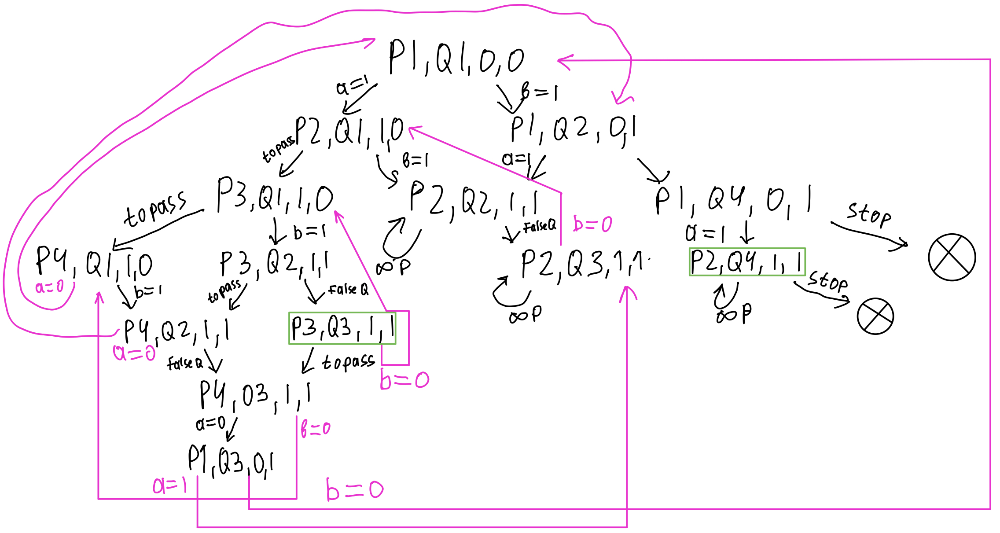

### Сколько различных достижимых состояний у вас получилось?
#### 14
### Возможна ли ситуация, при которой поток **P** находится в состоянии *P3* (critical section) в то время, как поток **Q** находится в состоянии *Q4* (завершил выполнение)? 
Рассмотрим достижимые состояния `[P2,Q4,1,1]`, `[P3,Q3,1,1]`, из которых мы могли бы попасть в `[P3,Q4,?,?]`:
* `[P2,Q4,1,1]`: мы не сможем покинуть это состояние, поскольку поток **Q** уже завершил исполнение, а значит не изменит переменную `b` на `0` и цикл в потоке **P** не завершится.
* `[P3,Q3,1,1]`: из этого состояния мы можем перейти только в состояния `[P4,Q3,1,1]`(перешли к следующей строчке потока **P**) и `[P3,Q1,1,0]`(цикл в потоке **Q** начнётся заново).
### Верно ли, что из любого состояние системы достижимо состояние *Q4*, при котором поток **Q** завершил выполнение? Почему так? 
Да, верно. Рассмотрим диаграмму, как граф, заметим, что данный граф образует цикл с "отростком", скондесируем граф. Граф принял форму: `A -> [P1,Q4,0,1] -> [P2,Q4,1,1]`